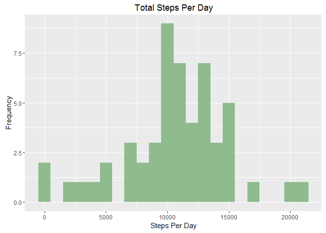
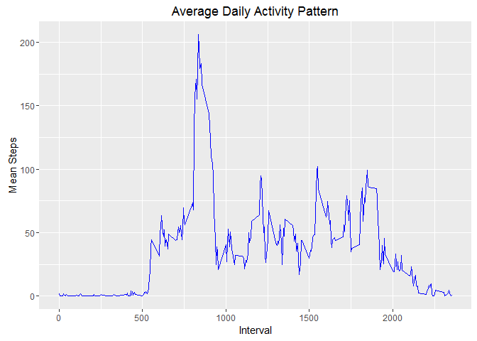
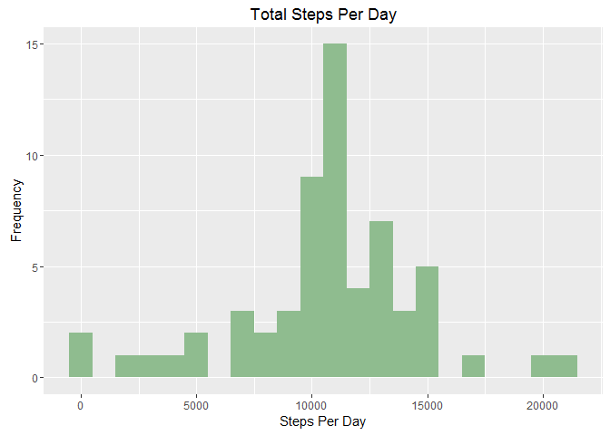
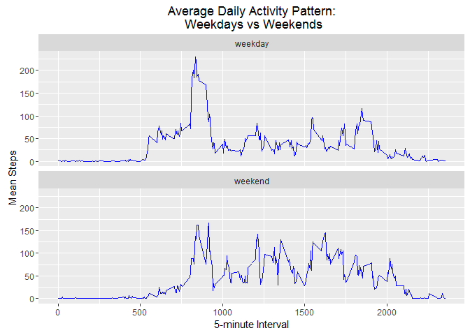

# Reproducible Research: Peer Assessment 1


## Load packages used for analysis

```r
library(ggplot2)
library(dplyr)
```

```
## 
## Attaching package: 'dplyr'
```

```
## The following objects are masked from 'package:stats':
## 
##     filter, lag
```

```
## The following objects are masked from 'package:base':
## 
##     intersect, setdiff, setequal, union
```

## Load and preprocess required data

```r
setwd("C:/Users/kasan/desktop/data_science_coursera/reproducible_research/assignment1/RepData_PeerAssessment1-master")
activity <- read.csv("activity.csv")
activity$date <- as.Date(activity$date, "%Y-%m-%d")
```

# What is the mean number of steps taken per day?

1. Calculate total number of steps per day

```r
stepsDate <- aggregate(steps ~ date, activity, sum, na.rm = TRUE)
```

2. Make a histogram of the total number of steps taken per day

```r
ggplot(stepsDate, aes(steps)) + 
  geom_histogram(binwidth = 1000, na.rm = TRUE, fill = "darkseagreen") + 
  ggtitle("Total Steps Per Day") + 
  labs(x = "Steps Per Day", y = "Frequency")
```

<!-- -->

3. Calculate and report the mean and median of the total number of steps taken per day

```r
meanSteps <- mean(stepsDate$steps, na.rm = TRUE)
medianSteps <- median(stepsDate$steps, na.rm = TRUE)
```

```r
print(meanSteps)
```

```
## [1] 10766.19
```

```r
print(medianSteps)
```

```
## [1] 10765
```

# What is the average daily activity pattern?

1. Make a time series plot (i.e. type = "l") of the 5-minute interval (x-axis) and the average number of steps taken, averaged across all days (y-axis)


```r
intervalSteps <- aggregate(steps ~ interval, activity, mean, na.rm = TRUE)

ggplot(data = intervalSteps, aes(x = interval, y= steps)) + 
  geom_line(color = "blue") +
  labs(x = "Interval", y = "Mean Steps") +
  ggtitle("Average Daily Activity Pattern")
```

<!-- -->

2. Which 5-minute interval, on average across all the days in the dataset, contains the maximum number of steps?

```r
maxSteps <- max(intervalSteps$steps)
which(grepl(206.1698, intervalSteps$steps))
```

```
## [1] 104
```

```r
intervalSteps[104,]
```

```
##     interval    steps
## 104      835 206.1698
```
Interval 835 (row 104) has the maximum number of steps.

# Impute missing values

1. Calculate and report the total number of missing values in the dataset (i.e. the total number of rows with NAs)

```r
sum(is.na(activity))
```

```
## [1] 2304
```

```r
sum(is.na(activity$steps))
```

```
## [1] 2304
```
There are 2304 missing values all in the steps column

2. Devise a strategy for filling in all of the missing values in the dataset. The strategy does not need to be sophisticated. For example, you could use the mean/median for that day, or the mean for that 5-minute interval, etc.

We will use the mean by 5-minute interval

3. Create a new dataset that is equal to the original dataset but with the missing data filled in.

```r
activityComplete <- activity 
for(i in 1:nrow(activityComplete)){
  if(is.na(activityComplete$steps[i])){
    replace <- intervalSteps$steps[intervalSteps$interval == activityComplete$interval[i]];
    activityComplete$steps[i] <- replace
  }
}
```

4. Make a histogram of the total number of steps taken each day and Calculate and report the mean and median total number of steps taken per day. Do these values differ from the estimates from the first part of the assignment? What is the impact of imputing missing data on the estimates of the total daily number of steps?


```r
stepsDate2 <- aggregate(steps ~ date, activityComplete, sum)

ggplot(stepsDate2, aes(steps)) + 
  geom_histogram(binwidth = 1000, na.rm = TRUE, fill = "darkseagreen") + 
  ggtitle("Total Steps Per Day") + 
  labs(x = "Steps Per Day", y = "Frequency")
```

<!-- -->

Calculate and report the mean and median total number of steps taken per day.

```r
mean(stepsDate2$steps)
```

```
## [1] 10766.19
```

```r
median(stepsDate2$steps)
```

```
## [1] 10766.19
```
Compare these numbers to calculations for the dataset with NAs intact: `meanSteps` 10766.19 and `medianSteps` 10765. The mean has not changed, but the median has increased slightly.

# Are there differences in activity patterns between weekdays and weekends?

1. Create a new factor variable in the dataset with two levels - "weekday" and "weekend" indicating whether a given date is a weekday or weekend day.

```r
activityComplete$day[weekdays(as.Date(activityComplete$date)) %in% c("Saturday","Sunday")] <- "weekend"
activityComplete$day[weekdays(as.Date(activityComplete$date)) %in% c("Monday", "Tuesday", "Wednesday", 
                                                                      "Thursday", "Friday")] <- "weekday"
activityComplete$day <- as.factor(activityComplete$day)
```

2. Make a panel plot containing a time series plot (i.e. type = "l") of the 5-minute interval (x-axis) and the average number of steps taken, averaged across all weekday days or weekend days (y-axis).

```r
meanActivityComplete <- aggregate(steps ~ interval + day, activityComplete, mean)

ggplot(data = meanActivityComplete, aes(x = interval, y = steps)) + 
  geom_line(color = "blue") +
  facet_wrap(~ day, ncol = 1) +
  labs(x = "5-minute Interval", y = "Mean Steps") +
  ggtitle("Average Daily Activity Pattern:\n Weekdays vs Weekends")
```

<!-- -->
